## IIC2613 Inteligencia Articial - Tarea 2

| Rut | UC | Nombre |
|:---:|:--:|:------:|
| 18501880-6 | 13634941 | Nicolás Gebauer Martínez


***

#### Información general

Primero se debe leer el [readme](readme.txt) adjunto para poder reproducir los resultados analizados en este informe.  
Al correr un script se genera un archivo `log` del mismo detallando los resultados junto con una imagen `png` correspondiente a la matriz de confusión obtenida del mejor _accuracy_ de predicción.  Para medir el rendimiento de las predicciones se utilizó la _accurracy_ dada por `sklearn.metrics.accuracy_score` y la _precision_ data por `sklearn.metrics.precision_score` con `average="macro"`


Los _logs_ siguen el siguiente formato:
 - Máximo `score` obtenido y valor iterable que lo produjo
 - Máximo `precision` obtenido y valor iterable que lo produjo
 - Iteraciones junto con el `score` y `precision` obtenidos y la correspondiente matriz de confusión

Los _logs_ están en `./logs` y las imágenes de las matrizes de confusión en `./logs/images`

Si se quisiera generar una imagen para una matriz de confusión basta correr `python` y ejecutar

```python
import data
dir = 's3_3_b'  # Nombre de la carpeta de ./logs/matrixes
iter = '1.0'    # Nombre de la iteración
data.image_matrix(dir, iter)
```

Luego la imagen de la matriz (normal y normalizada) se encontrará en `./logs/all_images/s3_3_b`

***

#### Vecinos cercanos

Para el clasificador de vecinos cercanos se utilizó `KNeighborsClassifier` de la librería `sklearn.neighbors`. Primero se obtuvieron las features de los datos de entrenamiento junto con sus labels y también para los datos de prueba. Luego se realizó la predicción con `k` vecinos, se obtuvo el _accuracy_ y _precision_ obtenidos, junto con la matriz de confusión y se registró en un archivo `.log`. También se generó una imagen para la matriz de confusión que tuvo el mejor _accuracy_.


##### Set pequeño

Para el set pequeño se iteró `k` de 1 a 100, con un incremento de 1, obteniendo los resultados detallados en [s3_1_s_1to100inc1.log](./logs/s3_1_s_1to100inc1.log).  
El mejor rendimiento obtenido fue:

| k |_accuracy_|_precision_|
|:-:|:-----:|:---------:|
|10 |0.905472636816|0.916337237324|

La matriz de confusión (normal y normalizada respectivamente):
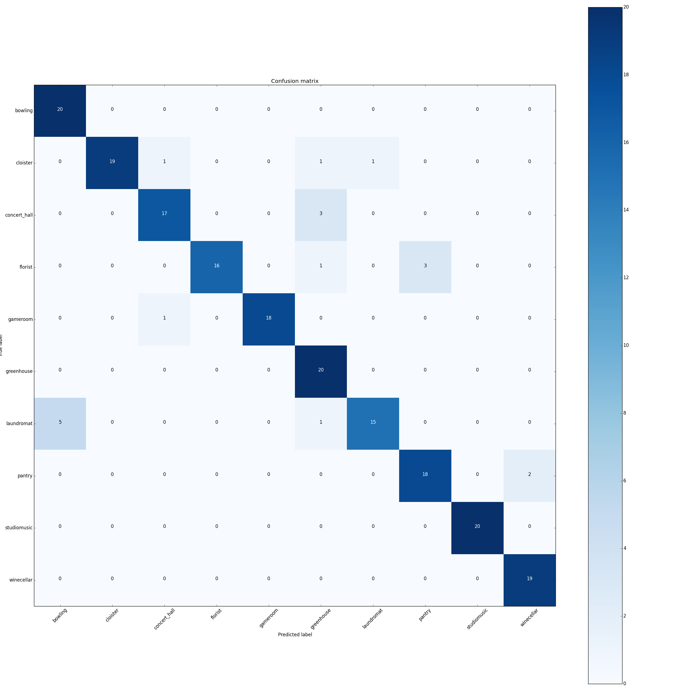
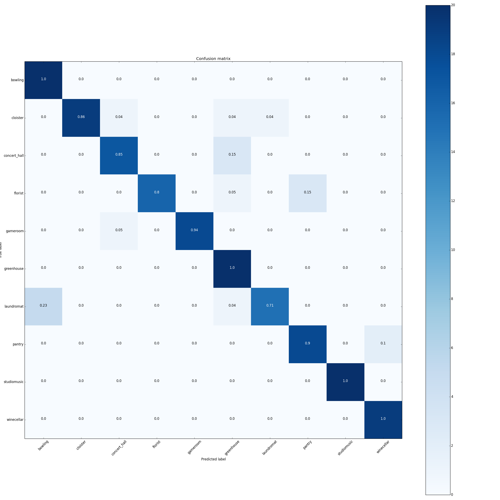

Se aprecia que el rendimiento aumenta constantemente al aumentar `k` de 1 a 10, y disminuye con mayores `k`. Es de notar que el hay pequeños intervalos donde el _accuracy_ aumenta un poco, pero la disminución continua.

##### Set grande

Para el set grande se iteró `k` de 1 a 10, con un incremento de 1. Luego se iteró `k` de 15 a 100, con un incremento de 5, obteniendo los resultados detallados en [s3_1_b_1to10inc1.log](./logs/s3_1_b_1to10inc1.log) y [s3_1_b_15to100inc5.log](./logs/s3_1_b_15to100inc5.log) respectivamente.  
El mayor _accuracy_ y _precision_ obtenidos fueron:

| k |_accuracy_|_precision_|
|:-:|:-----:|:---------:|
|25 |0.444361463779|0.555958647658|
|70 |0.431665421957|0.56973939847|

La matriz de confusión para `k=25` es la siguiente
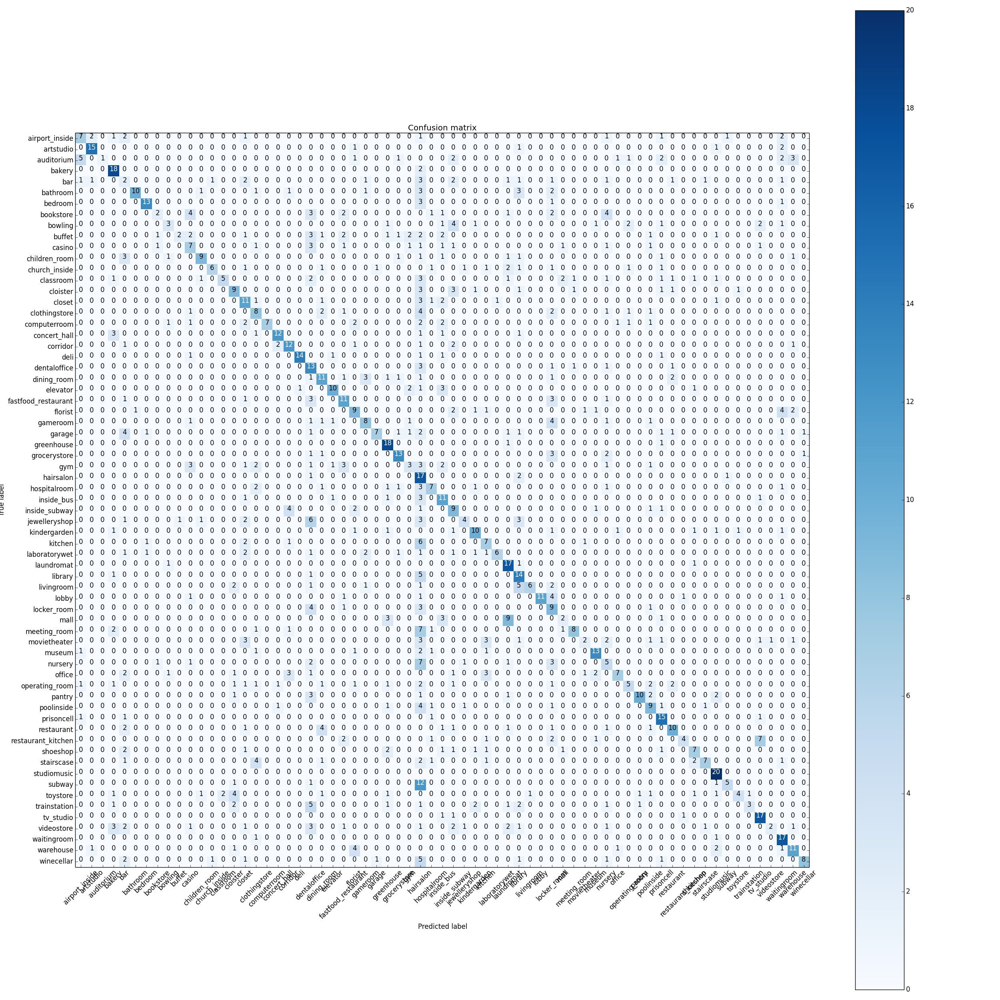
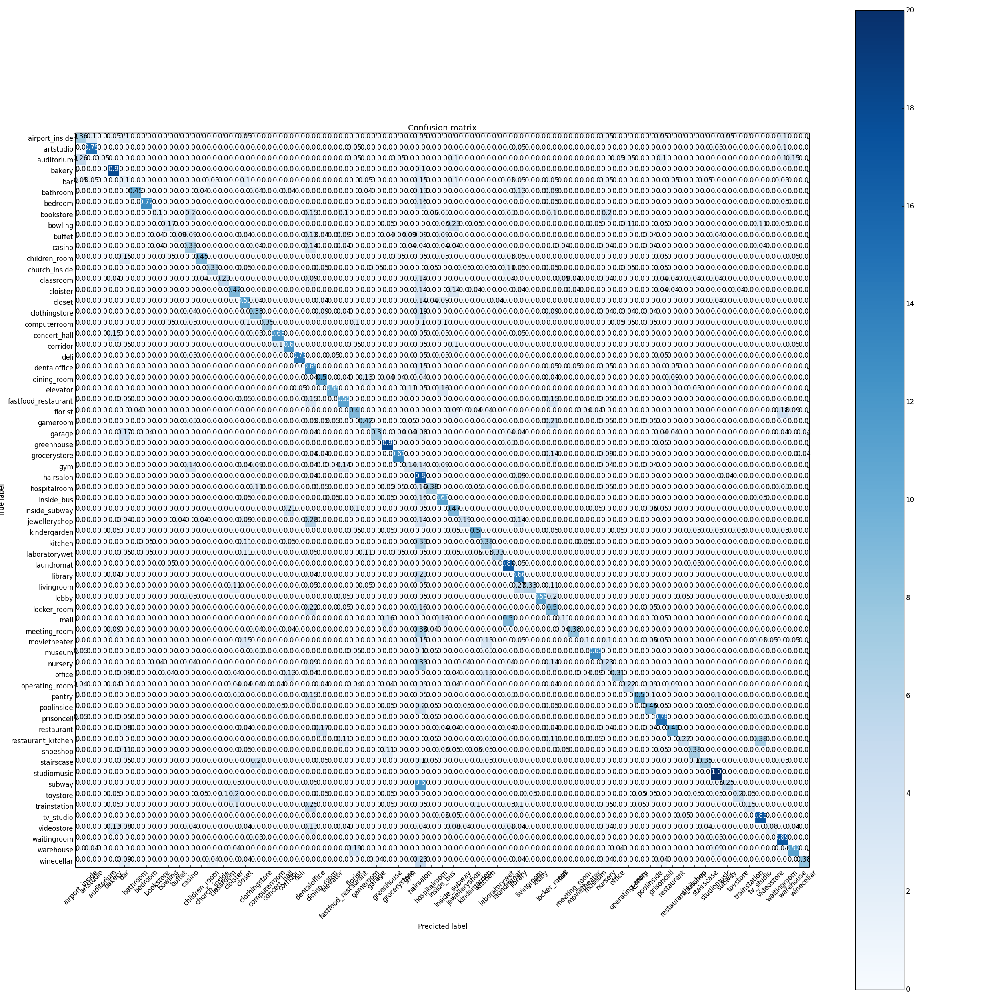

La matriz de confusión para `k=70` es la siguiente
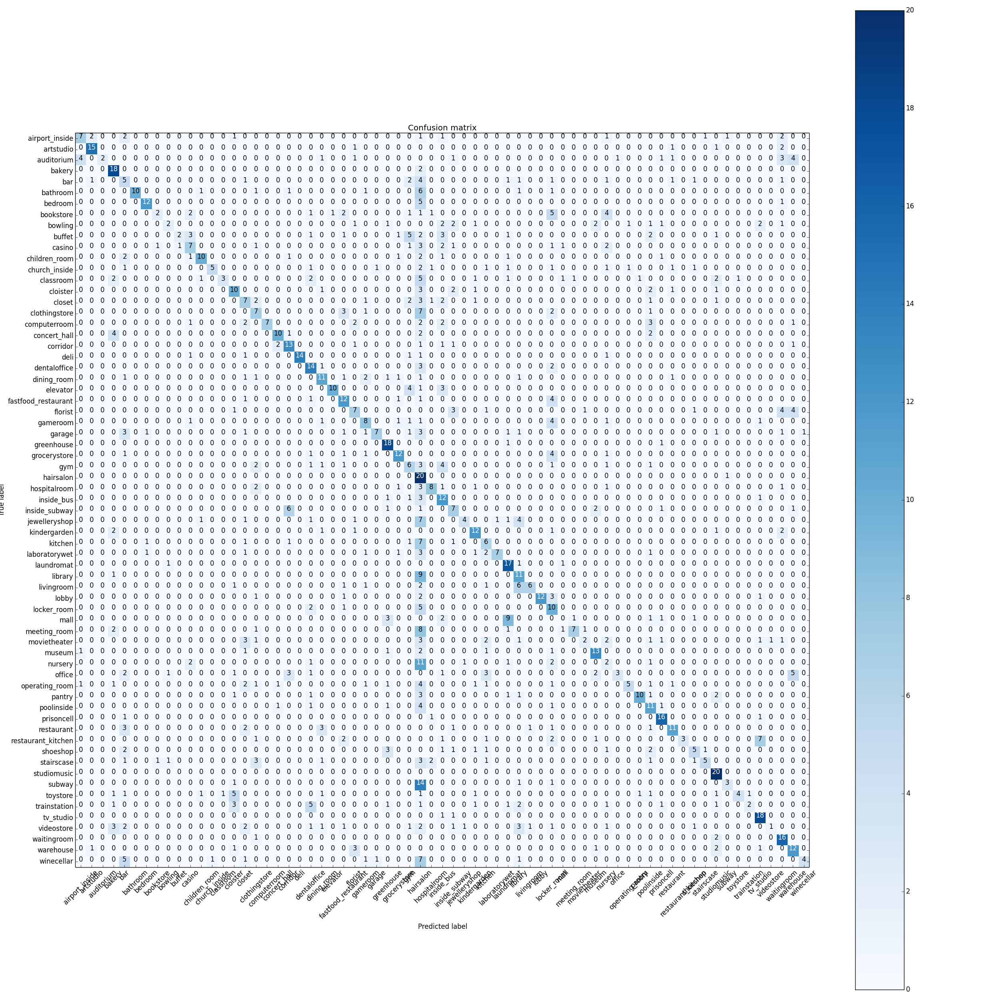
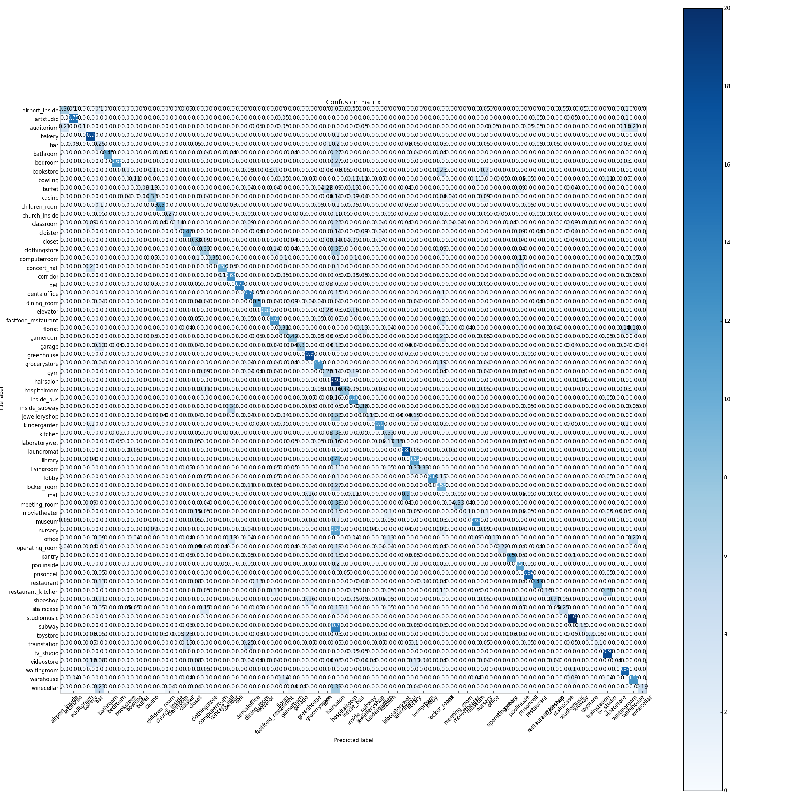

Gracias la intensidad de los colores podemos observar que un error importante de vecinos cercanos fue clasificar como _hairsalon_ elementos que no lo eran.

Se puede observar las clases que tuvieron peor clasificación viendo en la diagonal de la matriz los valores más claros.

#### Redes neuronales

Se entrenó una red neuronal usando el set MIT67-Train con 4096 neuronas en la capa de entrada, 2 codificaciones para la salida, las cuales fueron con los labels normales y en binario. Se entrenó usando gradiente estocástico y se probó el rendimiento utilizando el set MIT67-Test. Para la capa oculta se utilizó una sola capa donde la cantidad de neuronas `n` se iteró desde `1024` hasta `8192` con incrementos de `4096/4 = 1024`. Se decidió esta iteración para que la cantidad de neuronas tuviera una relación con la cantidad de features. Los resultados obtenidos se detallan en [s3_2_b.log](./logs/s3_2_b.log) (usando como salida los labels) y [s3_2_b_binary.log](./logs/s3_2_b_binary.log) (usando como salida la codificación (_cod_) binaria de los labels). Estos entrenamientos se hicieron con `200` iteraciones. Luego también se hizo el mismo entrenamiento con `1000` iteraciones (_iter_) con `1000` neuronas y `1050` neuronas.
Los mejores resultados obtenidos fueron:

|iter|cod|n|_accuracy_|_precision_|
|:-:|:-:|:-:|:-:|:-:|
|200|normal|6144|0.595967139656|0.604715099837|
|200|binario|7168|0.594473487677|0.601223295062|
|1000|normal|1050|0.562359970127|0.567250052256|
|1000|binario|1000|0.546676624347|0.55368963365|

La matriz de confusión para `n=6144, iter=200, cod=normal`:

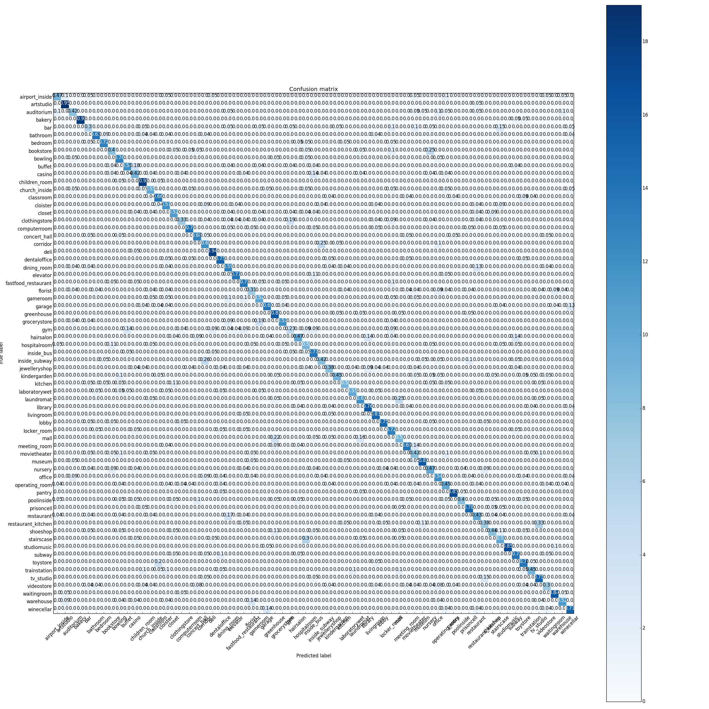

La matriz de confusión para `n=7168, iter=200, cod=binario`:


Se observa que el resultado obtenido con la codificación binario de la salida es menor que sin ella. Esta diferencia es muy pequeña, de un 0.1% aproximadamente. Esto puede deberse a que en realidad la codificación de entrada no afecta tanto el entrenamiento del modelo, en el sentido de como clasifica. Claramente hace un cambio en como hace la salida para coincidir con las esperadas, pero el algoritmo de clasificación mismo no se ve afectado. Además se debe recordar que las redes neuronales tienen un factor aleatorio, lo que podría ser el causante de la pequeña diferencia.

El número de neuronas en la capa oculta se iteró con múltiplos de las neuronas de entrada, es decir, de la cantidad de features. Esto fue una decisión arbitraria bajo el supuseto de ayudaría a que las neuronas se ajusten mejor al problema.

Para terminar de iterar el proceso se usó el valor por defecto. Luego se probó con `1000` debido a comentarios de compañeros que decían que daba un mejor rendimiento. Cuando se prueba el modelo con el set de entrenamiento se obtiene un rendimiento muy cercano a 100%, lo cual es esperable ya que el modelo se ajusta a los datos de entrenamiento. También es esperable que no sea de un 100% ya que redes neuronales incluye un factor de randomización para entrenarse.

Observando la matriz de confusión, las categorias con peor rendimiento fueron _bar_ y _gym_. Las mejores fueron _artstudio_, _children room_, _deli_ y _bakery_. Esto puede deberse a que tienen rasgos muy distintivos. _gym_ máquinas de ejercicio, _deli_ mucha comida, _bakery_ pan, _artstudio_ pinturas.


#### Máquinas de vectores de soporte

Se entrenó una máquina de vectores de soporte con el set MIT67-Train.zip, con los parámetros especificados en el enunciado.

Primero se probo el rendimiento del modelo con la penalización por defecto `C=1.0` obteniendo:

|C|_accuracy_|_precision_|
|:-:|:-:|:-:|
|1.0|0.642270351008|0.644320053371|

La matriz de confusión (normal y normalizada respectivamente):

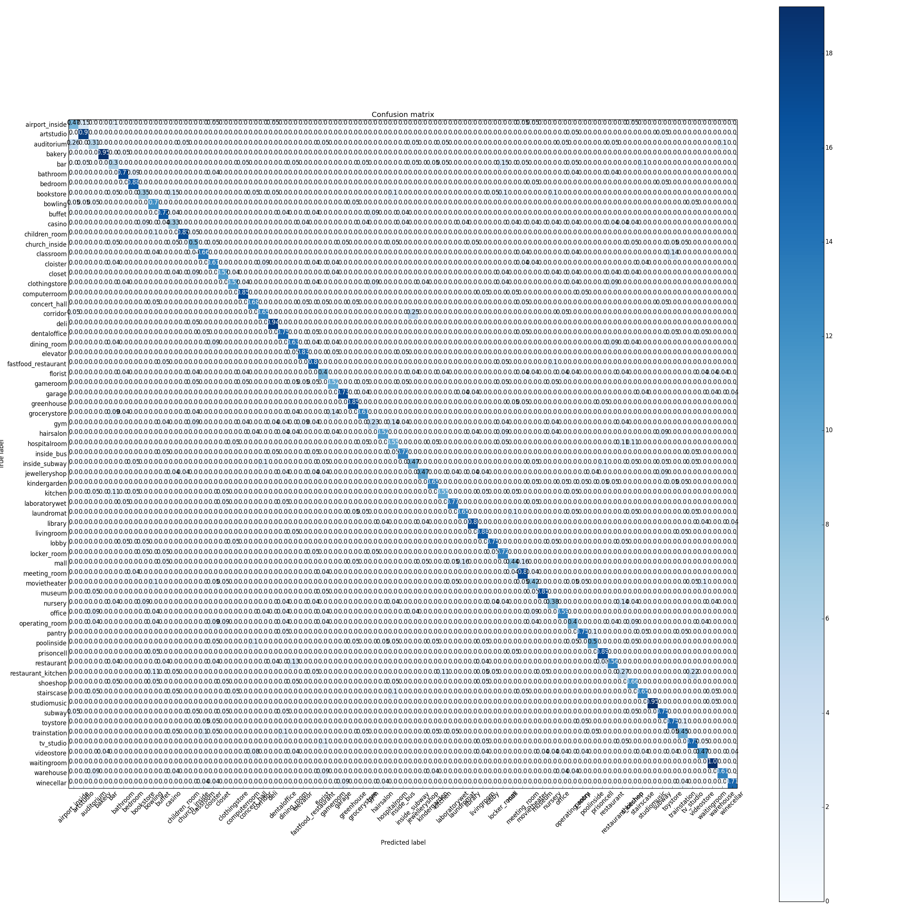

Se puede apreciar un resultado mejor al obtenido con vecinos cercanos y redes neuronales. Además se demoró menos que redes neuronales en ejecutarse.

Luego se volvió a realizar el mismo entrenamiento iterando el valor de la penalización `C` desde `0.5` hasta `10.0` con incrementos de `0.5`, obteniendo los resultados detallados en [s3_3_b.log](./logs/s3_3_b.log).  
El mayor _accuracy_ y _precision_ obtenidos fueron:

|C|_accuracy_|_precision_|
|:-:|:-:|:-:|
|2.5|0.643764002987|0.647550104501|

Es decir, una diferencia de un 0.14% en la _accuracy_ y de 0,32% en la _precision_. Se aprecia que la diferencia es mínima. De hecho, la peor _accuracy_ fue 0.63928304705 y se obtuvo con `C=4.0`. Todas las demás son mayores a 0.64, la variación del rendimiento cambiando la penalización fue casi despreciable.

La matriz de confusión (normal y normalizada respectivamente):
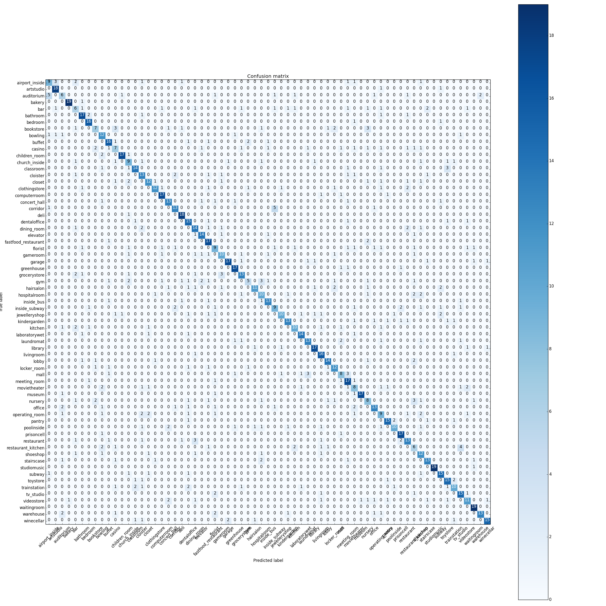


Al probar el clasificar haciendo `fit` con los datos de entrenamiento se obtiene una _accuracy_ muy alta, como se detalla en [s3_3_b_trainvtrain.log](./logs/s3_3_b_trainvtrain.log). Es decir, la separación de las clases que logra el clasificador es casi perfecta. Esto tiene sentido ya que la separación se ajusta al set de entrenamiento, luego es esperable que al intentar predecir el mismo el resultado sea tan correcto. También, al momento de realizarse esta separación hay puntos que pueden quedar del otro lado, es decir, no en su clase. El modelo se ajusta lo más posible para evitar esta situación pero de todas formas puede ocurrir, sobre todo en este caso donde tenemos un set grande de datos, lo que explica que la _accuracy_ no sea perfecta. Para esto se realizó el entrenamiento con las mismas iteraciones mencionas arriba.
El _accuracy_ obtenido fue el mismo para todos los `C` probados, en cambio la _precision_ fue variando, siendo la mayor:

|C|_accuracy_|_precision_|
|:-:|:-:|:-:|
|0.5|0.999067164179|0.999089697652|

La matriz de confusión (normal y normalizada respectivamente):
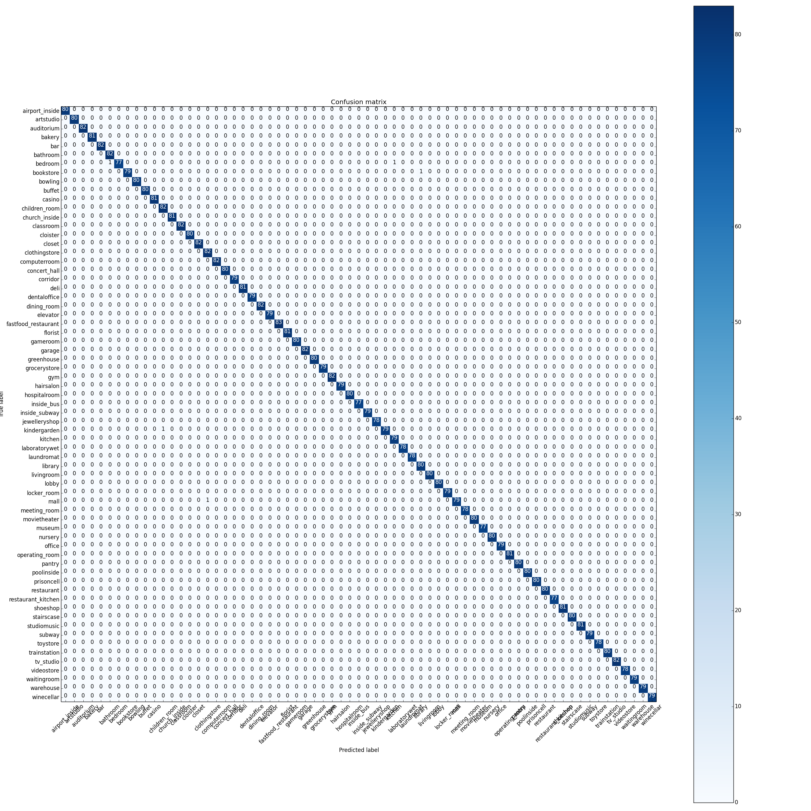
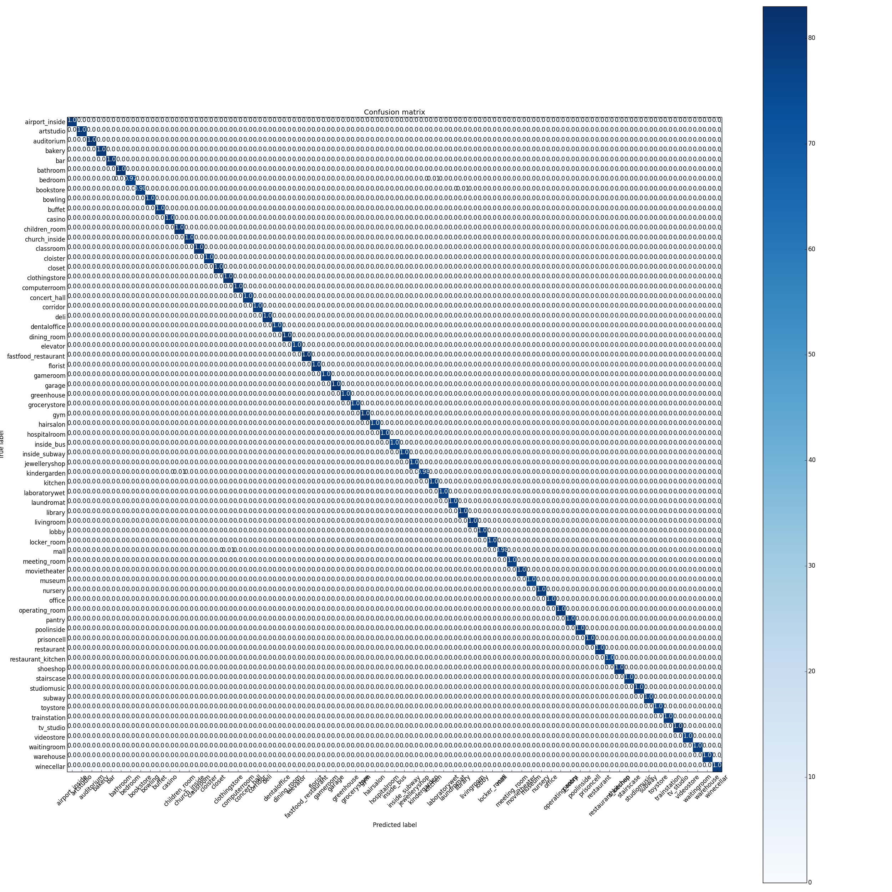

Las mejores categorías son
 - Artstudio
 - Bakery
 - Deli
 - Studiomusic
 - Waitingroom

De ellas la mejor es Waitingroom que tiene un rendimiento de 100%. Se destaca que todas las salas de espera presentan un patrón repetido, las sillas. Los estudios de arte presentan todos cuadros, Bakery tiene panes, Studiomusic instrumentos. Es decir, estas categorías contienen elementos que son constantes en todos los ejemplos y fáciles de diferenciar de otros.

Luego se realizó el mismo entrenamiento con el set pequeño de datos. Se itero `C` de `0.5` a `10.0` con incrementos de `0.5`, obteniendo los resultados detallados en [s3_3_s.log](./logs/s3_3_s.log).  
El mayor _accuracy_ y _precision_ obtenidos fueron:

|C|_accuracy_|_precision_|
|:-:|:-:|:-:|
|0.5|0.970149253731|0.971542443064|

La matriz de confusión (normal y normalizada respectivamente):

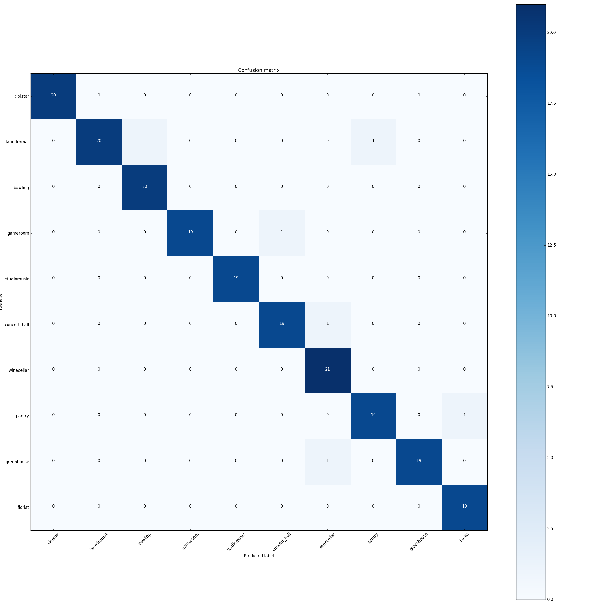

Es notable remarcar que el experimento con el set pequeño toma mucho menos tiempo que con el set grande, demorando aproximadamente unos 3 seg por iteracións, mientras que con el set grande tomaba unos minutos por iteración.  
También el modelo es mucho más exacto, con una _accuracy_ de 97%.  
Comparando con el rendimiento obtenido en el set de 67 clases vemos que es bastante mayor (33%). Esto puede deberse a que en el set más pequeño hay menos clases, además las clases del set pequeño son más distintas entre ellas que las del set grande. Es decir, se podría mejorar el rendimiento del clasificador en el set de 67 categorías si se hiciera una clasificación por etapas. Primero separar en grupos de categorías y luego separar en ellas. Con esto me refiero a, por ejemplo, tomar todos los clasificados como librería o biblioteca y luego hacer un clasificador particular para ambos. Con esto se debería lograr un mejor clasificador, ya que si separamos biblioteca y librería junto con todas las otras clases, biblioteca y librería quedarían muy cerca. Si en cambio los separamos solo entre ellos y al separar con las demás clases los consideramos como una sola clase se obtendrá una mejor clasificación.


#### Resultados comparativos

##### Facilidad de uso

A través de la librería utilizada todos los clasificadores fueron fáciles de usar. Al principio es un poco más difícil, pero luego de utilizar uno se hace más fácil usar los otros. Esto gracias a que presentan interfaces muy similares para las acciones que se tienen que ejecutar con métodos como `fit` y `predict`.

##### Tiempo de proceso

Se observa que el tiempo de proceso de las redes neuronales es por lo lejos el mayor de todos. Los tiempos de proceso son `Red neuronal >> Vectores de soporte > Vecinos cercanos`. Luego, Vecinos cercanos y Vectores de soporte retornando resultados más rápido que la red neuronal.

##### Exactitud de la clasficiación. Tipos de error

Se obtuvo que el rendimiento es `Vectores de soporte > Red neuronal > Vecinos cercanos`. También se observa que en Vectores de soporte los errores suelen darse entre clases que son muy parecidas. En redes neuronales occure con clases que comparten ciertos features particulares, sin necesidad de que sean tan iguales. En vecinos cercanos ocurre un error parecido a vectores de soporte.
